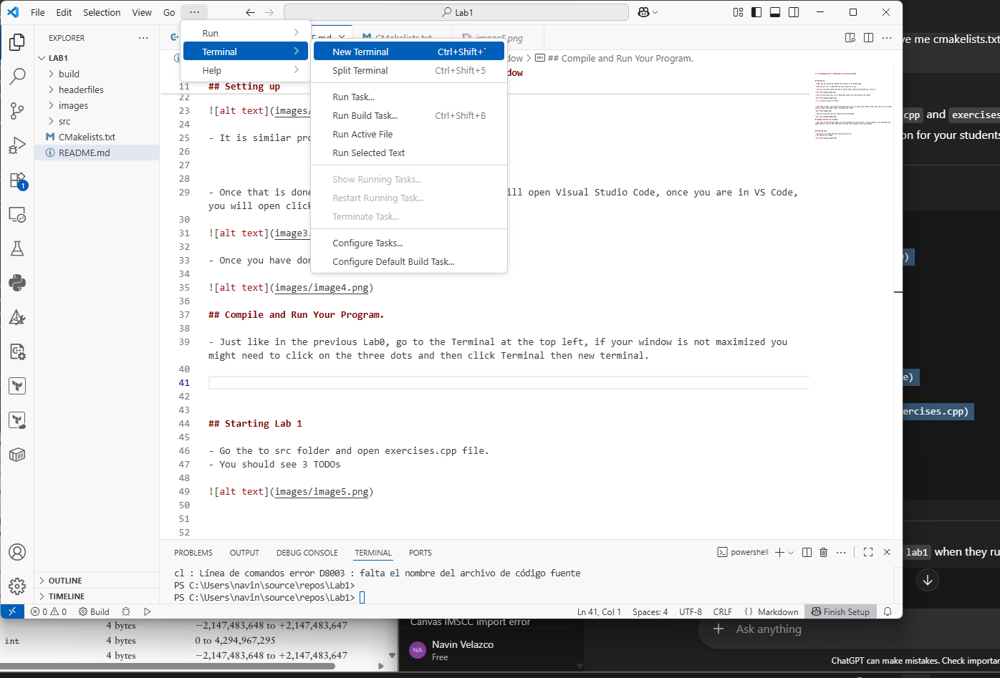
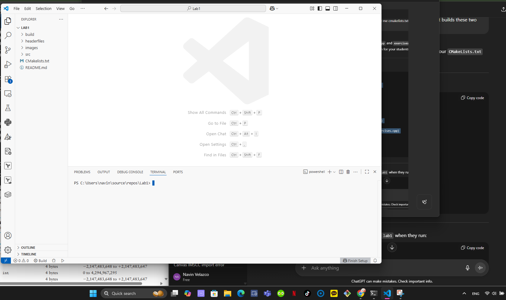
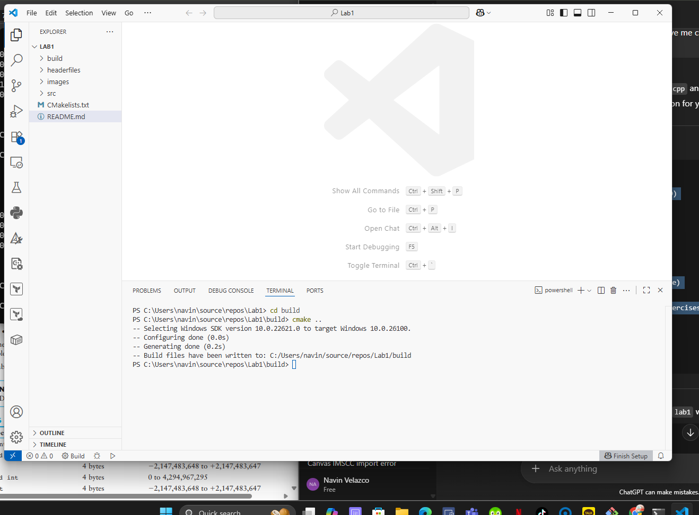
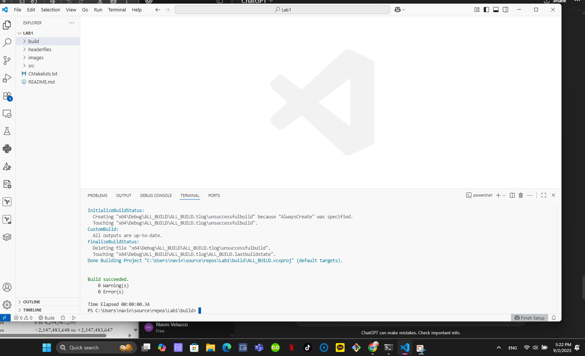
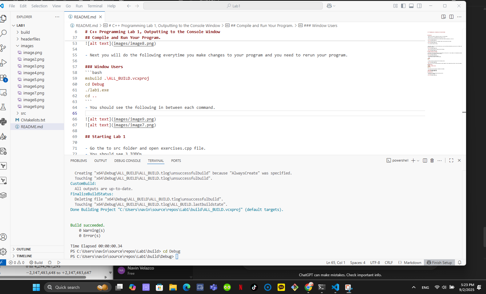
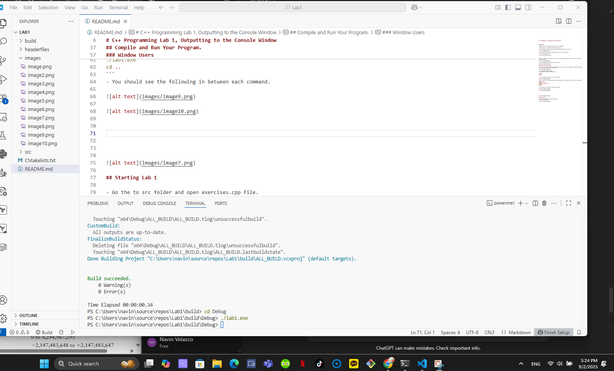
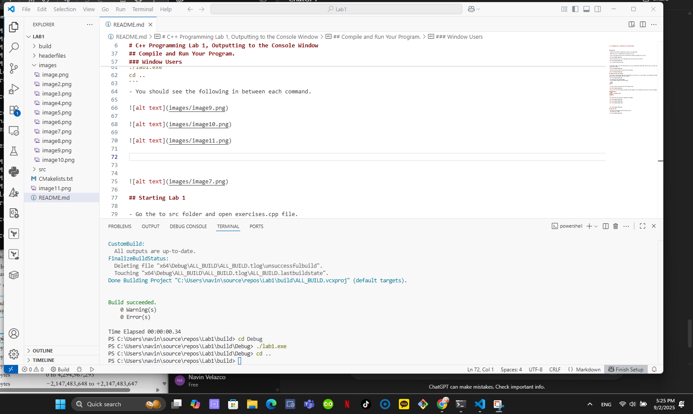

# C++ Programming Lab 1: Outputting to the Console Window


## Setting up 

- Right now you should be reading this project in my GitHub page.

- What you will do, is download the this project as a zip.

- Click on the green button and the at bottom there should be download zip. Click it!


- Once you have done that, go to downloads right click and extract the folder


- It is similar process for Macs!


- Once that is done, just like the previous Lab, you will open Visual Studio Code, once you are in VS Code, you will open click open folder, and open Lab1 folder.


- Once you have done that you should see the following


## Compile and Run Your Program.

- Just like in the previous Lab0, go to the Terminal at the top left, if your window is not maximized you might need to click on the three dots and then click Terminal then new terminal.



- You should see the following page.


- In the terminal windows run the following.

```bash
cd build
cmake ..
cd ..
```

- If done correctly you should see the following screen.



### Window/Desktop Users
- Next you will do the following everytime you make changes to your program and you need to rerun your program. Mac users jump to next section. You will do the same except a different way. This is the most important part of the lab!

```bash
./run.ps1
```
- You should see the following in between each command. 









### MAC users
```bash 
./run.sh
```
## Starting Lab 1

- Go the to src folder and open exercises.cpp file.
- You should see 3 TODOs


- Everytime you want to run your program after you make changes,
- Go back to the section that I mentioned above that needs to be repeated everytime
- you run your program.


